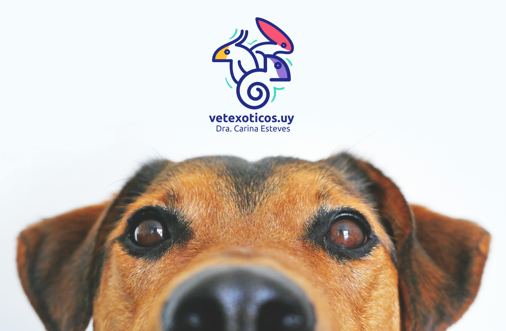

# Vetexoticos pet shop Wordpress theme

## Overview:

Vetexoticos Pet Shop Wordpress Theme is a versatile and customizable theme designed specifically for pet shops, groomers, and pet care service providers. With a sleek design and user-friendly interface, it offers a seamless experience for both website administrators and visitors.



## Technologies Used:


## Run via Docker:

### 1. Install Docker
Ensure Docker is installed on your system. You can download Docker from the <a href="https://www.docker.com/" target="_blank">official Docker website</a>.

### 2. Create a Docker Compose File
Create a docker-compose.yaml file in your project directory with the following content:
```yml
    version: '1'

    services:
    # Database
    db:
        image: mysql:5.7
        volumes:
        - db_data:/var/lin/mysql
        restart: always
        environment: 
        MYSQL_ROOT_PASSWORD: password
        MYSQL_DATABASE: wordpress
        MYSQL_USER: wordpress
        MYSQL_PASSWORD: wordpress
        networks:
        - wpsite
    # Phpmyadmin
    phpmyadmin:
        depends_on:
        - db
        image: phpmyadmin/phpmyadmin
        restart: always
        ports:
        - '8080:80'
        environment:
        PMA_HOST: db
        MYSQL_ROOT_PASSWORD: password
        networks:
        - wpsite
    # Wordpress
    wordpress:
        depends_on:
        - db
        image: wordpress:latest
        ports:
        - '8000:80'
        restart: always
        volumes: ['./:/var/www/html']
        environment:
        WORDPRESS_DB_HOST: db:3306
        WORDPRESS_DB_USER: wordpress
        WORDPRESS_DB_PASSWORD: wordpress
        networks:
        - wpsite
    networks:
    wpsite:
    volumes:
    db_data:
```

### 3. Start the Docker Container
```sh
    docker-compose up -d
```
This command will download the required Docker images and start the containers.

### 4. Access the WordPress Installation
Once the containers are up and running, you can access the WordPress installation by navigating to http://localhost:8000 in your web browser.

### 5. Complete the WordPress Installation
Follow the on-screen instructions to complete the WordPress installation.

### 6. Manage Your Docker Containers
To stop the containers, run:
```sh
    docker-compose down
```
To start them again, run:
```sh
    docker-compose up -d
```


## Run via XAMPP:

### 1. Download XAMPP
Go to the official Apache Friends website and download the correct XAMPP software version based on your operating system.

### 2. Install and Run XAMPP on Your Computer
Run the XAMPP installer and follow the installation instructions using the default settings. If you see a pop-up indicating that your antivirus software might affect the installation process, click Yes to continue.

After installing XAMPP, run the application and configure the environment. In the XAMPP control panel, start Apache and MySQL modules to perform the WordPress localhost installation.

If you’re running on the Windows operating system, there’s a chance you might encounter the localhost refused to connect error. Disabling your firewall temporarily or stopping the program that uses port 80 should resolve this issue.

### 3. Download WordPress
Once the server is up and running, the next step is installing WordPress. Download the latest WordPress version, then extract the ZIP file.

Navigate to your XAMPP folder in the C drive (C:\xampp) and locate the htdocs folder. Upload the extracted WordPress files there. We recommend renaming the new folder with your website’s name to make web development on the XAMPP server easier.

### 4. Create a Local Database
Go back to your XAMPP control panel and select the Admin button of the MySQL module to launch phpMyAdmin ‒ an administration tool for managing MySQL and MariaDB databases. It will help you create a local MySQL database for the new website.

Open the Databases tab and enter the database name into the Create database section. Set the dropdown menu’s value to Collation and hit the Create button. Your new MySQL database should appear on the left sidebar of the web page.

### 5. Install WordPress on Localhost
Finish installing WordPress locally by visiting http://localhost/foldername via your browser. Don’t forget to change the “foldername” placeholder with the folder name you chose in the third step.

WordPress requires a list of information to build the localhost site. Fill in the database information as follows:

```
Database name ‒ the name of the database you created in phpMyAdmin.
Username ‒ enter “root” as the default username.
Password ‒ leave the MySQL database password field blank.
Database host ‒ keep the default “localhost.”
Table prefix ‒ keep the default “wp_.”
```

Once done, hit Submit -> Run the installation. Fill in the additional information needed, like the site name and login credentials, and click on the Install WordPress button.

### 6. Check the Local Site You Built
That’s it – your local test site is now ready. Go to http://localhost/foldername/wp-admin and use the login credentials you created in the previous step to access the WordPress dashboard.


## Customization

### Add custom home page in Wordpress:
In the Wordpress administrator create a new page and then go to Settings => Reading. In "
Your homepage displays" select "A static page" and select the page from the list.

### Add menu items:
In the Wordpress administrator create a new menu. Then create a few pages, add them to the menu and in "Menu Settings" go to "Display location" and select "Desktop Primary Left Sidebar".

### Customize menu items classes:
In the Wordpress administrator go to Appearence => Menus and in the top-right section click on the tab "Screen Options". In "Show advanced menu properties" check "Link Target" and "CSS Classes". Then go to the menu items and add the class "nav-item" in every one of them.

### Add FontAwesome icons to the menus items:
In the Wordpress administrator go to Appearence => Menus and in "Navigation Label" paste the icon alongside the menu item name, like this:
```html
    <i class="fas fa-home"></i> Sample page
```

### Add Blog page:
In the Wordpress administrator create a new page called "Blog". Then go to Settings => Reading and in "Your homepage displays" go to "Posts page" and select the Blog page.

### Add About page:
In the Wordpress administrator create a new page  and enter a title for it (e.g., "About Us"). 

In the "Page Attributes" section on the right side, select the "About" template from the "Template" dropdown.

Leave the content area blank or add a brief description for reference and publish the page.

### Run SASS command:
```sh
    sass --watch scss/style.scss style.css
```

## JSON Abstraction of static content:

### Purpose:
I store static data in a JSON files located in the theme's data directory. This allows for easy management and retrieval of data without hardcoding in PHP files.

Please note that the JSON data files are not included in the GitHub project. You will need to create these files manually in the `data` directory of the theme. Ensure the JSON files are structured accordingly:

### Files:

brands.json
```json
{
    "brandname": "brandname.png",
    ... Add more as you need.
}
```

pet-hotel.json
```json
[
    {
        "title": "Lorem ipsum",
        "description": ["Lorem ipsum dolor sit amet, consectetur adipiscing elit."]
    },
    ... Add more as you need.
]
```

services.json
```json
[
    {
        "title": "Lorem ipsum",
        "description": "Lorem ipsum dolor sit amet, consectetur adipiscing elit.",
        "icon": "fa-solid fa-bone"
    },
    ... Add more as you need.
]
```

testimonials.json
```json
[
    {
        "name": "DJohn Doe",
        "testimonial": ["Lorem ipsum dolor sit amet, consectetur adipiscing elit."],
        "avatarSrc": "/assets/images/client-1.jpg"
    },
    ... Add more as you need.
]
```

## Roadmap:

### Template Development
- [X] Design Standard Pages Layout
- [X] Customize Woocomerce styles
- [X] Style Search Results Page
- [X] Develop Custom Header and Footer

### WooCommerce Integration
- [X] Integrate WooCommerce Functions
- [X] Configure Product Variation Display
- [ ] Implement Product Filtering Options
- [ ] Implement Wishlist and Compare Features

### Design & Styling
- [X] Implement Responsive Design for Mobile Devices
- [X] Ensure Cross-Browser Compatibility
- [ ] Optimize Loading Speeds for Improved Performance
- [ ] Implement Accessibility Features

### Quality Assurance & Deployment
- [ ] Review and Optimize Codebase
- [ ] Conduct User Testing
- [ ] Ensure Compatibility with Latest WooCommerce Versions
- [ ] Address Feedback and Bug Fixes

## Future Enhancements:
- [X] Integration with MercadoPago
- [ ] Implement Custom Widgets for Product Recommendations
- [ ] Develop Advanced Filtering and Sorting Options
- [ ] Incorporate Social Media Sharing Features
- [ ] Enhance User Account Dashboard Features
- [ ] Implement Advanced Analytics for Sales Tracking
